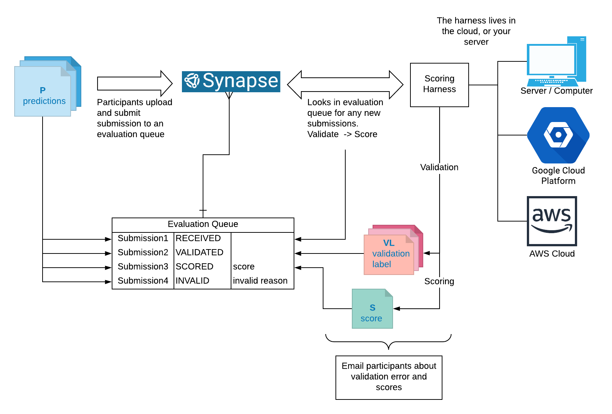

Python Challenge Scoring Harness
================================

In a perfect world, Synapse would automatically validate, score, annotate submissions and email participants for you.  Sadly, we do not live in a perfect world! 

Fortunately, we have created `challenge.py`, a lightweight python script, that takes a configuration python as a parameter that you can run on the cloud (AWS, Google, Azure) or your internal servers/clusters.  This script will automatically look for received submissions to an evaluation queue and validate/score these submissions.

If you have no idea what evaluation queues or challenge are, then please turn back around.  If you are curious about setting up a challenge, please view the step-by-step [Challenge Guide Overview](https://docs.synapse.org/articles/challenge_administration.html) to building out a challenge before continuing. 


## Dependencies

* Python 3.5 and above
* R if you use rpy2
* Software:
```
pip install synapseclient
pip install git+https://github.com/Sage-Bionetworks/challengeutils.git
# If you are using rpy2, must install version 2.9.x
pip install rpy2==2.9
```

## Creating your challenge python script.

Please make a copy of the `challenge_config.template.py` as a start to creating your own configuration script.

You will need to add an evaluation queue for each question in your challenge and write appropriate validation and scoring functions. Then, customize the messages with challenge specific help for your solvers.  Information about evaluation queues can be found [here](https://docs.synapse.org/articles/evaluation_queues.html)

In your configuration file **challenge_config.template.py**, you can add in separate `validate`, `score1`, `score2`, and `score...` functions for each question in your challenge.  You can name these functions anything you want as long as you set up a evaluation queue and function or file mapping.  
```
EVALUATION_QUEUES_CONFIG = [
    {
        'id': 1,
        'scoring_func': score1
        'validation_func': validate_func
        'goldstandard': 'path/to/sc1gold.txt'
    },
    {
        'id': 2,
        'scoring_func': score2
        'validation_func': validate_func
        'goldstandard': 'path/to/sc2gold.txt'

    }
]
```

## Running the Harness

As stated above, Synapse does not have the capability of validating and scoring submissions.  The diagram below depicts how the scoring harness connects your validation/scoring script to Synapse and participant submissions. 

Here are some examples on how to run the script.

```
# See all the available parameters
python challenge.py -h

# Validation
python challenge.py syn1234 challenge_config.template.py --send-messages --notifications --acknowledge-receipt validate

# Scoring
python challenge.py syn1234 challenge_config.template.py --send-messages --notifications --acknowledge-receipt score

```


### Messages and Notifications

The script can send several types of messages, which are in `messages.py`. 

* *--send-messages* instructs the script to email the submitter when a submission fails validation or gets scored.
* *--notifications* sends error messages to challenge administrators which can be specified by `--admin-user-ids`. Defaults to the user running the harness.
* *--acknowledge-receipt* is used when there will be a lag between validation and scoring to let users know their submission has been received and passed validation.


### RPy2

Often it's more convenient to write statistical code in R. We've successfully used the [Rpy2](https://rpy2.bitbucket.io/) library to pass file paths to scoring functions written in R and get back a named list of scoring statistics. 

## Setting Up Automatic Validation and Scoring on an EC2

It is very typical for validation and scoring to occur every 5 to 10 minutes, as you want challenge participants to be informed of their submissions.  To do this on a cloud instance (AWS, Google, Azure...), a cronjob can be set up.  To set this up, first open the crontab configuration file:

	crontab -e

Paste this into the file:

	# minute (m), hour (h), day of month (dom), month (mon)                      
	*/10 * * * * python challenge.py ....

Note: the first 5 * stand for minute (m), hour (h), day of month (dom), and month (mon). The configuration to have a job be done every ten minutes would look something like */10 * * * *
